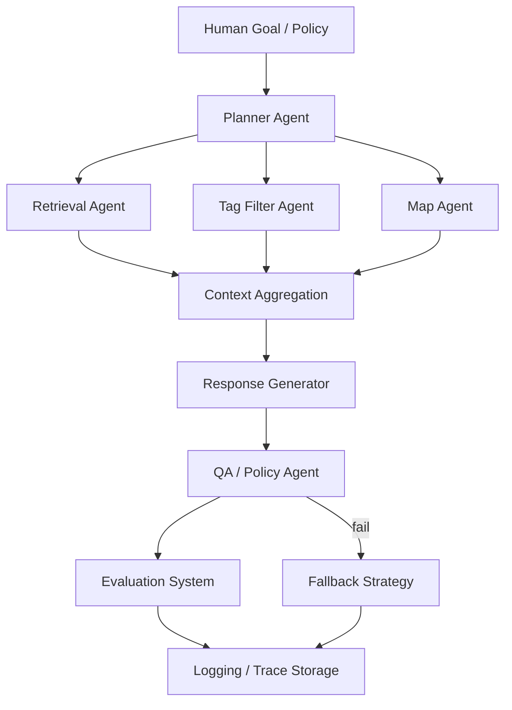

## System Architecture

Bready for Suwon is designed as a **human-orchestrated agent system** for local bakery discovery.

Instead of a single LLM pipeline, the system decomposes a user request into a structured workflow of **planning → execution → validation → evaluation → logging**.

### Architecture Overview

### Agent Roles

Planner Agent
- Decomposes the user query into executable tasks
- Generates a structured workflow plan

Execution Agents
- Retrieval Agent → vector DB search for relevant reviews
- Tag Filter Agent → SQL filtering by bakery attributes
- Map Agent → location retrieval via Kakao Map API

Response Generator
- Produces explanations and bakery recommendations using retrieved context

QA / Policy Agent
- Prevents hallucinated bakery recommendations
- Ensures responses follow system policies

Evaluation System
- Measures retrieval quality and policy compliance
- Enables eval-driven development

Logging & Rollback
- Stores full agent traces
- Enables debugging and fallback strategies
